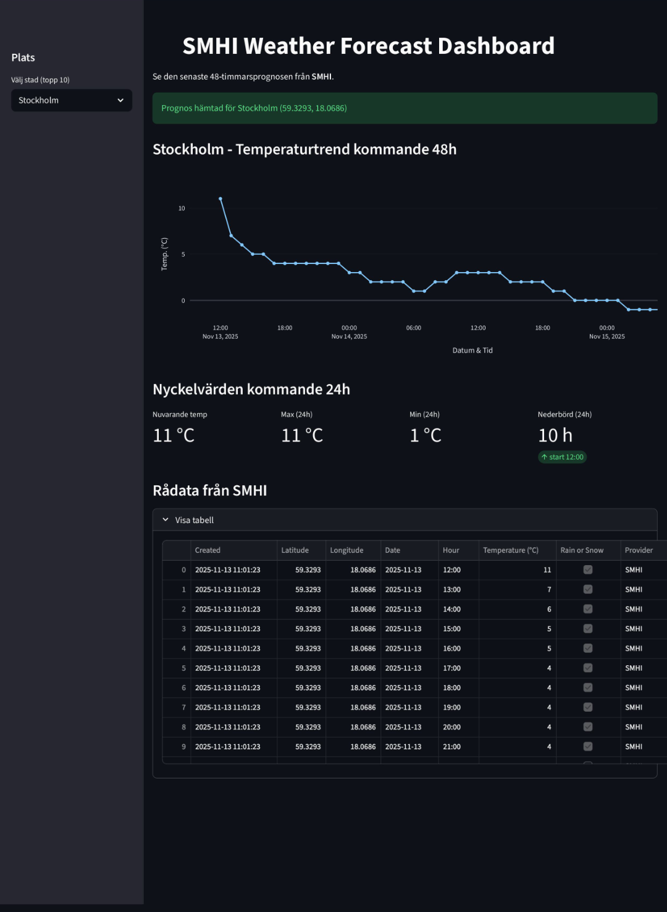

# 📘 SMHI Weather Dashboard - DevOps Pipeline

Detta dokument beskriver projektets arkitektur, funktionalitet,
CI/CD-pipeline, tester och designval.

------------------------------------------------------------------------

## 🌦️ Funktionalitet

-   Hämtar väderprognoser från SMHI:s öppna API.
-   Extraherar temperatur, tid, nederbörd m.m.
-   Bearbetar datan till ett Pandas-DataFrame.
-   Körs som Docker-container i Azure Web App via Docker Hub.

------------------------------------------------------------------------

## 🧪 Tester

### ✔ Enhetstester (mockade)

-   SMHI-anrop mockas med `unittest.mock.patch`.
-   Testar databehandlingslogik och datastruktur.
-   Körs automatiskt i pipelinen.
-   Blockerar build vid fel.

### ✔ Integrationstest

-   Testar att applikationen kan hantera verkliga SMHI-responser.
-   Körs separat (workflow_dispatch).

------------------------------------------------------------------------

## 🔧 CI/CD Pipeline (GitHub Actions)

Pipeline-filen ligger i `.github/workflows/main-rsn3.yml`.

### Innehåller två jobb:

------------------------------------------------------------------------

### **1. tests**

-   Körs på push och workflow_dispatch.
-   Installerar beroenden.
-   Kör pytest och genererar loggfil.
-   Laddar upp loggar som artefakt *om och endast om*:
    -   workflow_dispatch används,
    -   parametern `log_errors=true`,
    -   testerna misslyckas.

------------------------------------------------------------------------

### **2. build-and-push**

-   Körs endast om testerna är godkända (`needs: tests` +
    `if: result == success`).
-   Bygger Docker-image med Docker Buildx.
-   Taggar imagen med:
    -   latest
    -   commit-SHA
    -   branch-namn
-   Pushar imagen till Docker Hub.

Azure Web App är konfigurerad att automatiskt hämta senaste imagen från
Docker Hub.

------------------------------------------------------------------------

## 🔐 GitHub Environment & Secrets

För att pipelinen ska fungera krävs environment:

    DOCKER_HUB

I denna environment ska följande secrets finnas:

  Secret                    Funktion
  ------------------------- -------------------------
  **DOCKER_HUB_USERNAME**   Docker Hub användarnamn
  **DOCKER_HUB_TOKEN**      Docker Hub Access Token

Access Token genereras via Docker Hub

------------------------------------------------------------------------

## 🐳 Docker

### Bygg lokalt:

``` bash
docker build -t smhi_weather_dashboard .
```

### Kör lokalt:

``` bash
docker run -p 8501:8501 smhi_weather_dashboard
```

------------------------------------------------------------------------

## 🧩 Designval

### 1️⃣ Mockade tester i CI

För att pipelines ska vara stabila och reproducerbara mockas externa
API-anrop.\
Detta säkerställer att fel eller långsamhet hos SMHI inte stoppar
utvecklingsflödet.

### 2️⃣ needs + if för logik och beroenden

`build-and-push` körs endast om `tests`-jobbet är grönt.\
Detta garanterar kvalitet före distribution.

### 3️⃣ workflow_dispatch-parameter för loggar

Ger kontroll och gör pipelinen mer flexibel:\
Man kan begära detaljerade felsökningsloggar endast när det behövs.

### 4️⃣ Docker tag-strategi

Tre tags används: - `latest` för Azure Web App. - commit-SHA för
spårbarhet. - branch-namn för parallella miljöer.

### 5️⃣ Docker Hub som registry

Azure Web App drar automatiskt senaste imagen från Docker Hub.\
Detta ger en enkel och robust deploy-modell.

------------------------------------------------------------------------

## Dashboard Preview


